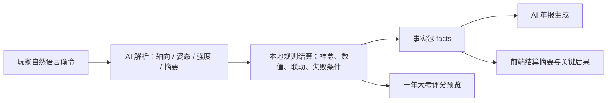

# AI 宗门模拟器

AI-native 宗门经营模拟游戏原型。玩家在十年周期内每年输入一条自然语言谕令，AI 将谕令解析为策略姿态，规则系统结算宗门数值，再由 AI 根据事实边界撰写年报。目标是在第十年大考中拿到尽可能高的宗门评级。

## 作品亮点

- 自然语言谕令不是普通聊天，而是游戏输入：玩家话语会映射到人、财、物、势四轴姿态。
- 规则结算和 AI 文本分离：数值由本地规则决定，AI 只负责解析与叙事表达，避免年报脱离事实。
- 有完整回合闭环：谕令输入、神念消耗、AI 解析、数值结算、年报反馈、十年评级预览。
- 前端做了求职展示需要的边界体验：等待阶段文案、超时重试、神念不足建议、API Key 缺失说明。

## 本地运行

```bash
npm install
cp .env.example .env
npm run dev
```

打开 `http://127.0.0.1:8787`。

联网 AI 默认使用 DeepSeek 兼容接口：

```bash
AI_PROVIDER=deepseek
DEEPSEEK_API_KEY=
DEEPSEEK_BASE_URL=https://api.deepseek.com
DEEPSEEK_MODEL=deepseek-chat
OPENAI_MODEL=gpt-4.1-mini
```

在本地 `.env` 中填入 `DEEPSEEK_API_KEY` 后即可测试真实联网 AI。不要提交 `.env`、API Key 或 Token。

## Netlify 联网部署

Netlify 站点需要在后台配置服务端环境变量，不能把密钥写进前端代码或仓库：

1. 进入 Netlify 项目后台。
2. 打开 `Site configuration` -> `Environment variables`。
3. 添加 `DEEPSEEK_API_KEY`，或添加 `OPENAI_API_KEY`。
4. 如果使用 DeepSeek，建议同时添加：

```bash
AI_PROVIDER=deepseek
DEEPSEEK_BASE_URL=https://api.deepseek.com
DEEPSEEK_MODEL=deepseek-chat
OPENAI_MODEL=gpt-4.1-mini
```

5. 保存后触发一次 `Deploys` -> `Trigger deploy` -> `Deploy site`。
6. 部署完成后访问 `/api/new-game` 应返回 JSON，试玩提交谕令时不应再出现缺少服务端 Key 的错误。

## 演示模式

没有 AI Key 时，可以用测试模式验证界面和规则闭环：

```bash
AI_TEST_MODE=true npm run dev
```

测试模式会使用本地 fallback 解析和年报，不代表正式联网 AI 的文本质量，但适合面试演示和离线排查。

## GitHub Pages 部署

仓库内置 GitHub Pages Actions 工作流：推送到 `main` 后会自动执行类型检查、构建并发布 `dist`。

GitHub Pages 是静态托管环境，没有 Express 后端。在线页面会自动使用前端静态演示兜底，能完整体验谕令、神念、规则结算、年报和十年评级预览；真实联网 AI 体验需要在本地运行后端或另行部署 API 服务。

## 3 分钟试玩脚本

1. 打开主界面，说明目标：十年大考拿到更高宗门评级。
2. 进入“天机外务”，展示人、财、物、势四轴预览和当前短板。
3. 回到“传音谕令”，输入一条短谕令，例如：`闭门清修，先稳住弟子心气。`
4. 展示输入框下方的字数、神念消耗和等待阶段文案。
5. 年报返回后，讲解“本年结算摘要”：神念变化、执事评语、风险提示。
6. 展示“关键后果”：收益、代价、风险最多突出 3 条，说明威胁上涨会作为风险而不是收益。
7. 回到主界面，说明新状态会影响下一年策略和最终十年评级。

## AI 如何参与玩法



AI 负责理解玩家意图和撰写叙事，核心数值变化由本地规则控制。这样既能保留自然语言输入的自由度，又能让游戏结果可解释、可测试。

## 关键代码路径

- `src/App.tsx`：主界面、传音界面、年报展示、等待和错误体验。
- `src/domain/resolveTurn.ts`：回合结算、神念消耗与回复、数值联动。
- `src/domain/stanceConfig.ts`：二十种姿态的收益、副作用和事件种子。
- `src/domain/rating.ts`：十年大考四轴评分与最终评级。
- `src/domain/decreeCost.ts`：谕令有效字数统计和神念消耗。
- `server/index.ts`：本地 Express API、AI 解析和年报生成入口。
- `server/ai/openaiClient.ts`：OpenAI-compatible / DeepSeek 调用与测试模式 fallback。

## 验证

```bash
npm test
npm run typecheck
npm run build
```

当前重点测试覆盖：

- 谕令字数和神念消耗规则。
- 回合结算与神念回复顺序。
- API 响应兼容和错误提示。
- 十年评级计算。

## 密钥安全

`DEEPSEEK_API_KEY` 或 `OPENAI_API_KEY` 只允许保存在 `.env` 或部署平台密钥配置中。前端代码、提交历史、年报文本和调试输出都不得包含 API Key。
